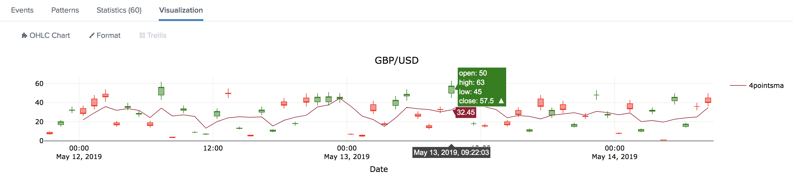
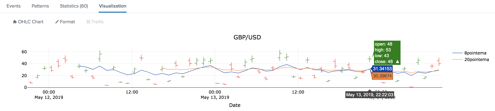
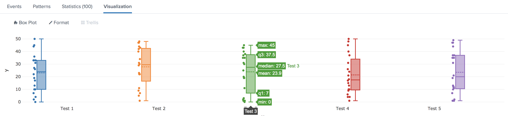
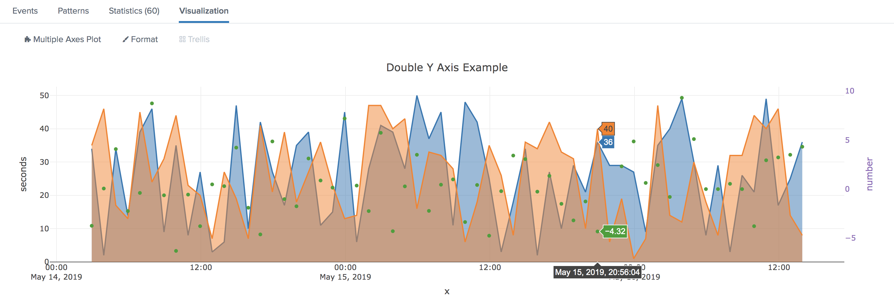
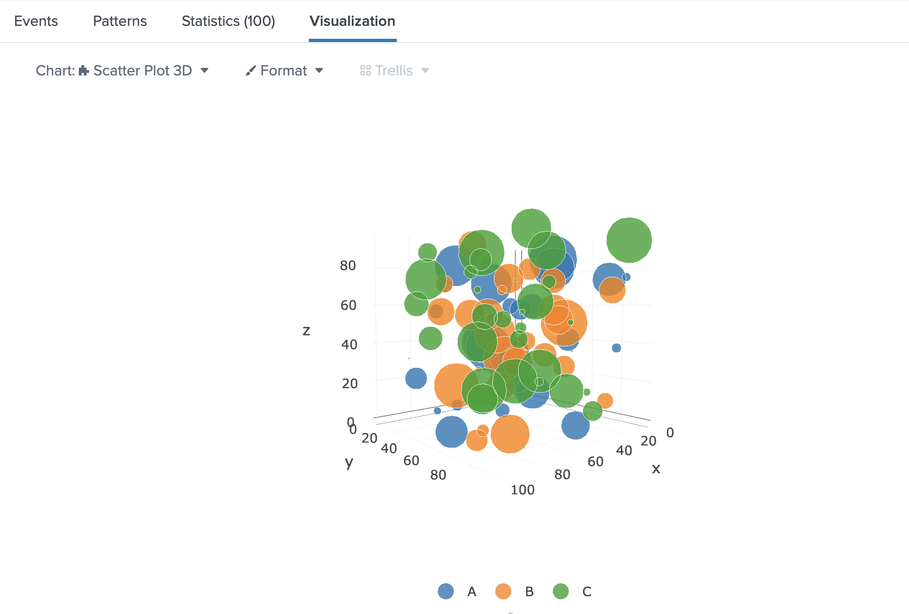

# Financial and Advanced Statistical Data Visualizations

A collection of Splunk modular visualizations based on [plotly.js](https://github.com/plotly/plotly.js/), a JavaScript open-source library used to create interactive charts for finance, engineering and sciences.

Visualizations included into this collection:
* [OHLC Chart](#ohlc-chart) for Stocks and Financial Data :hammer_and_wrench: [source code](appserver/static/visualizations/ohlc/src/visualization_source.js)
* [Box Plot Chart](#box-plot) for Statistical Data :hammer_and_wrench: [source code](appserver/static/visualizations/boxplot/src/visualization_source.js)
* [Multiple Axes Chart](#multiple-axes-plot) for Advanced Statistical Data Visualizations :hammer_and_wrench: [source code](appserver/static/visualizations/multiple-axes/src/visualization_source.js)
* [Scatterplot 3D](#scatterplot3d) for Multiple Dimensions / Clustering Data Visualizations :hammer_and_wrench: [source code](appserver/static/visualizations/scatterplot3d/src/visualization_source.js)

## Installation
Please refer to the [Splunk Documentation](https://docs.splunk.com/Documentation/AddOns/released/Overview/Installingadd-ons) for guidance on installing the Add-On in your environment. The app needs to be installed on the SH tier.

Download is available from either [GitHub](https://github.com/splunk/splunk-plotly-collection-viz/releases) or [Splunkbase](https://splunkbase.splunk.com/app/5730/).

## Usage
* Type your search
* Click on tab `Visualization` and then select either `OHLC Chart`, `Box Plot` or `Multiple Axes` among available visualizations
* Format the visualization as needed

### OHLC Chart
`<basesearch> | table _time open close high low [currencypair] [8pointEMA] [20pointEMA] [4pointSMA]`

If not provided, default values will be used for optional fields `currencypair`, `8pointEMA`, `20pointEMA` and `4pointEMA`.

> Field names **must** correspond to the ones specified above to be properly handled by the visualization

### Box Plot
`<basesearch> | table box_name value`

Replace `box_name` and `value` with your fields to start.

| FieldName   | Format  | Description              | Example   |
|-------------|---------|--------------------------|-----------|
| `box_name`  | string  | Label of the box         | `A`       |
| `value`     | numeric | Data forming box dataset | `20`      |

### Multiple Axes Plot
`<basesearch> | table _time scatter-y2-dataset1 scatter-y2_datasetN line-y-dataset1 line-y-datasetN`

Replace `_time`, `scatter-y2-datasetX` and `line-y-datasetX` with your fields to start.

| FieldName              | Format  | Description                                  | Example               |
|------------------------|---------|----------------------------------------------|-----------------------|
| `_time`                | date    | Event time reference                         | `2019-05-17 07:30:02` |
| `scatter-y2-dataset1`  | numeric | Dataset for 1st scatter plot on secondary Y-Axis | `-1.6`            |
| `scatter-y2-datasetN`  | numeric | Dataset for Nth scatter plot on secondary Y-Axis | `-2`              |
| `line-y-dataset1`      | numeric | Dataset for 1st line plot on regular Y-Axis      | `10`              |
| `line-y-datasetN`      | numeric | Dataset for Nth line plot on regular Y-Axis      | `32`              |

> Field names **must** begin with `scatter` and `line` to be properly handled by the visualization

### Scatterplot 3D
`<basesearch> | table trace x y z [marker_size]`

If not provided, default values will be used for optional field `marker_size`.

Replace `trace`, `x`, `y` and `z` with your fields to start.

| FieldName   | Format  | Description              | Example   |
|-------------|---------|--------------------------|-----------|
| `trace`  | string  | Label of the trace         | `A`       |
| `x`     | numeric | X-coordinate of data forming trace dataset | `20`      |
| `y`     | numeric | Y-coordinate of data forming trace dataset | `2`      |
| `z`     | numeric | Z-coordinate of data forming trace dataset | `100`      |
| `marker_size`     | numeric | Size of the data marker in pixels. Range [1-50]. | `20`      |

## Example
This app comes with a dashboard showcasing simple usages of mentioned charts.

* Navigate to `Apps / Search & Reporting / Dashboards`
* Click on the dashboard `Overview of Plotly Charts for Splunk`
* Be inspired

## Contributing
* :rocket:   Want to **contribute**? [Open a Pull Request](https://github.com/splunk/splunk-plotly-collection-viz/pulls)
* :bug:   Found a **bug**? [Open an issue](https://github.com/splunk/splunk-plotly-collection-viz/issues/new?assignees=edro15&labels=&template=bug_report.md&title=)
* :bulb:   Got an idea for a **new feature**? [Open a feature request](https://github.com/splunk/splunk-plotly-collection-viz/issues/new?assignees=edro15&labels=&template=feature_request.md&title=)

## License
This project is licensed under [Apache-2.0](./packages/splunk_plotly_collection_viz/LICENSE.md)
